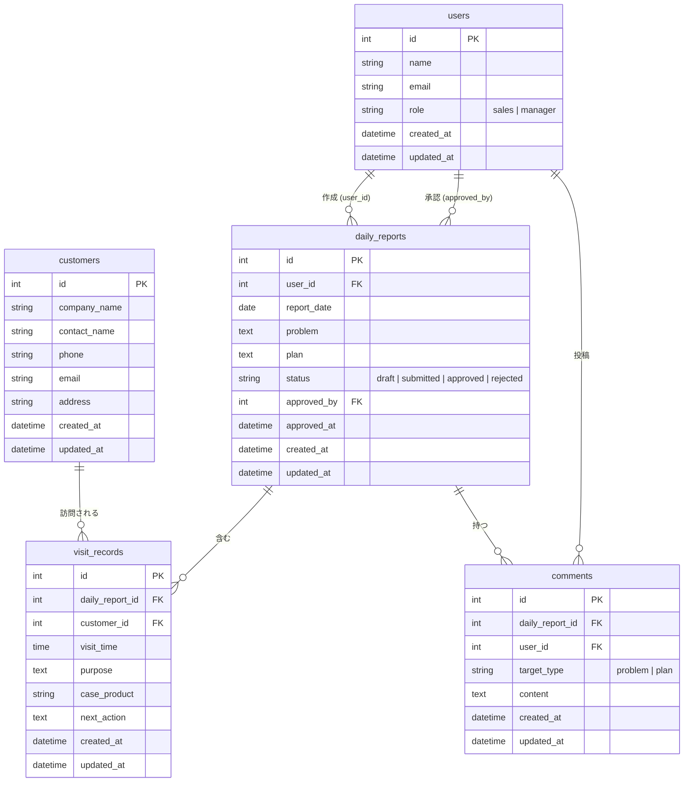

# 営業日報システム DB定義書

## テーブル一覧

| テーブル名      | 説明                                     |
| --------------- | ---------------------------------------- |
| `users`         | ユーザーマスタ（営業・マネージャー共通） |
| `customers`     | 顧客マスタ                               |
| `daily_reports` | 日報（1人1日1件）                        |
| `visit_records` | 訪問記録（日報に紐づく複数行）           |
| `comments`      | Problem/Plan へのコメント                |

---

## ER図

---

## テーブル詳細

### users（ユーザーマスタ）

| カラム名   | 型           | NOT NULL | PK/FK | 説明                                   |
| ---------- | ------------ | -------- | ----- | -------------------------------------- |
| id         | INT          | ○        | PK    |                                        |
| name       | VARCHAR(100) | ○        |       | 氏名                                   |
| email      | VARCHAR(255) | ○        |       | メールアドレス（ログインID、ユニーク） |
| role       | VARCHAR(20)  | ○        |       | `sales` / `manager`                    |
| created_at | DATETIME     | ○        |       |                                        |
| updated_at | DATETIME     | ○        |       |                                        |

### customers（顧客マスタ）

| カラム名     | 型           | NOT NULL | PK/FK | 説明           |
| ------------ | ------------ | -------- | ----- | -------------- |
| id           | INT          | ○        | PK    |                |
| company_name | VARCHAR(200) | ○        |       | 会社名         |
| contact_name | VARCHAR(100) | ○        |       | 担当者名       |
| phone        | VARCHAR(20)  | -        |       | 電話番号       |
| email        | VARCHAR(255) | -        |       | メールアドレス |
| address      | TEXT         | -        |       | 住所           |
| created_at   | DATETIME     | ○        |       |                |
| updated_at   | DATETIME     | ○        |       |                |

### daily_reports（日報）

| カラム名    | 型          | NOT NULL | PK/FK         | 説明                                            |
| ----------- | ----------- | -------- | ------------- | ----------------------------------------------- |
| id          | INT         | ○        | PK            |                                                 |
| user_id     | INT         | ○        | FK → users.id | 作成者                                          |
| report_date | DATE        | ○        |               | 報告日（user_id と組み合わせてユニーク）        |
| problem     | TEXT        | -        |               | 課題・相談                                      |
| plan        | TEXT        | -        |               | 明日やること                                    |
| status      | VARCHAR(20) | ○        |               | `draft` / `submitted` / `approved` / `rejected` |
| approved_by | INT         | -        | FK → users.id | 承認者（承認済の場合のみ）                      |
| approved_at | DATETIME    | -        |               | 承認日時                                        |
| created_at  | DATETIME    | ○        |               |                                                 |
| updated_at  | DATETIME    | ○        |               |                                                 |

**ユニーク制約**: `(user_id, report_date)`

### visit_records（訪問記録）

| カラム名        | 型           | NOT NULL | PK/FK                 | 説明               |
| --------------- | ------------ | -------- | --------------------- | ------------------ |
| id              | INT          | ○        | PK                    |                    |
| daily_report_id | INT          | ○        | FK → daily_reports.id | 対象日報           |
| customer_id     | INT          | ○        | FK → customers.id     | 訪問先顧客         |
| visit_time      | TIME         | ○        |                       | 訪問時刻           |
| purpose         | TEXT         | ○        |                       | 訪問目的・内容メモ |
| case_product    | VARCHAR(255) | -        |                       | 担当案件・商品     |
| next_action     | TEXT         | -        |                       | 次回アクション     |
| created_at      | DATETIME     | ○        |                       |                    |
| updated_at      | DATETIME     | ○        |                       |                    |

### comments（コメント）

| カラム名        | 型          | NOT NULL | PK/FK                 | 説明               |
| --------------- | ----------- | -------- | --------------------- | ------------------ |
| id              | INT         | ○        | PK                    |                    |
| daily_report_id | INT         | ○        | FK → daily_reports.id | 対象日報           |
| user_id         | INT         | ○        | FK → users.id         | 投稿者             |
| target_type     | VARCHAR(10) | ○        |                       | `problem` / `plan` |
| content         | TEXT        | ○        |                       | コメント本文       |
| created_at      | DATETIME    | ○        |                       |                    |
| updated_at      | DATETIME    | ○        |                       |                    |
