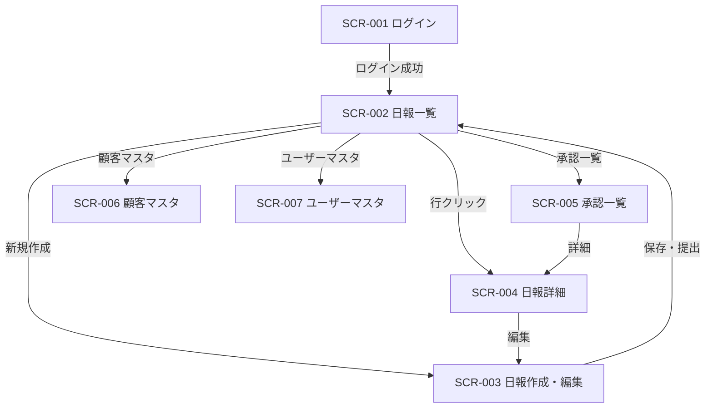

# 営業日報システム 画面定義書

## 画面一覧

| 画面ID  | 画面名                 | 対象ロール |
| ------- | ---------------------- | ---------- |
| SCR-001 | ログイン画面           | 全員       |
| SCR-002 | 日報一覧画面           | 全員       |
| SCR-003 | 日報作成・編集画面     | sales      |
| SCR-004 | 日報詳細画面           | 全員       |
| SCR-005 | 承認一覧画面           | manager    |
| SCR-006 | 顧客マスタ管理画面     | manager    |
| SCR-007 | ユーザーマスタ管理画面 | manager    |

---

## SCR-001 ログイン画面

### 概要

システムへのログイン画面。

### 画面レイアウト

```
┌─────────────────────────────────┐
│         営業日報システム          │
│                                 │
│  メールアドレス                   │
│  ┌─────────────────────────┐    │
│  │                         │    │
│  └─────────────────────────┘    │
│                                 │
│  パスワード                       │
│  ┌─────────────────────────┐    │
│  │                         │    │
│  └─────────────────────────┘    │
│                                 │
│       [ ログイン ]               │
└─────────────────────────────────┘
```

### 項目定義

| 項目名         | 種別       | 必須 | 備考 |
| -------------- | ---------- | ---- | ---- |
| メールアドレス | テキスト   | ○    |      |
| パスワード     | パスワード | ○    |      |

### アクション

| アクション   | 遷移先               |
| ------------ | -------------------- |
| ログイン成功 | SCR-002 日報一覧画面 |

---

## SCR-002 日報一覧画面

### 概要

日報の一覧を表示する。営業は自分の日報のみ、マネージャーは全員分を閲覧できる。

### 画面レイアウト

```
┌──────────────────────────────────────────────────────┐
│ 営業日報システム          [田中 太郎 ▼] [ログアウト]  │
├──────────────────────────────────────────────────────┤
│ 日報一覧                            [ + 新規作成 ]    │
│                                                      │
│ 期間: [2026/03/01] 〜 [2026/03/31]  担当: [全員 ▼]  │
│                                                      │
│ ┌────────────┬──────────┬────────────┬────────────┐  │
│ │ 報告日     │ 担当者   │ 訪問件数   │ ステータス │  │
│ ├────────────┼──────────┼────────────┼────────────┤  │
│ │ 2026/03/16 │ 田中太郎 │ 3件        │ 提出済     │  │
│ │ 2026/03/15 │ 田中太郎 │ 2件        │ 承認済     │  │
│ │ 2026/03/14 │ 佐藤花子 │ 4件        │ 差し戻し   │  │
│ └────────────┴──────────┴────────────┴────────────┘  │
└──────────────────────────────────────────────────────┘
```

### 項目定義

| 項目名     | 説明                                                                  |
| ---------- | --------------------------------------------------------------------- |
| 期間       | 絞り込み用の開始日・終了日（デフォルト: 当月）                        |
| 担当       | 担当者フィルター（マネージャーのみ表示）                              |
| 報告日     | 日報の対象日                                                          |
| 担当者     | 作成者名                                                              |
| 訪問件数   | visit_records の件数                                                  |
| ステータス | draft:下書き / submitted:提出済 / approved:承認済 / rejected:差し戻し |

### アクション

| アクション     | 遷移先                     |
| -------------- | -------------------------- |
| 行をクリック   | SCR-004 日報詳細画面       |
| 新規作成ボタン | SCR-003 日報作成・編集画面 |

### 権限

| ロール  | 表示範囲         | 新規作成ボタン |
| ------- | ---------------- | -------------- |
| sales   | 自分の日報のみ   | 表示           |
| manager | 全ユーザーの日報 | 非表示         |

---

## SCR-003 日報作成・編集画面

### 概要

日報を新規作成、または下書き・差し戻し状態の日報を編集する画面。salesロールのみアクセス可能。

### 画面レイアウト

```
┌──────────────────────────────────────────────────────┐
│ 営業日報システム          [田中 太郎 ▼] [ログアウト]  │
├──────────────────────────────────────────────────────┤
│ 日報作成                                             │
│                                                      │
│ 報告日: [2026/03/16]                                 │
│                                                      │
│ ── 訪問記録 ────────────────────────────  [ + 追加 ] │
│ ┌──────────┬──────┬────────────┬──────┬────────┬───┐ │
│ │ 顧客     │時刻  │訪問目的    │案件  │次回ACT │   │ │
│ ├──────────┼──────┼────────────┼──────┼────────┼───┤ │
│ │[株式会社▼]│[10:00]│[           ]│[    ]│[      ]│[x]│ │
│ │[        ▼]│[    ]│[           ]│[    ]│[      ]│[x]│ │
│ └──────────┴──────┴────────────┴──────┴────────┴───┘ │
│                                                      │
│ ── Problem（課題・相談） ──────────────────────────── │
│ ┌────────────────────────────────────────────────┐   │
│ │                                                │   │
│ │                                                │   │
│ └────────────────────────────────────────────────┘   │
│                                                      │
│ ── Plan（明日やること） ───────────────────────────── │
│ ┌────────────────────────────────────────────────┐   │
│ │                                                │   │
│ │                                                │   │
│ └────────────────────────────────────────────────┘   │
│                                                      │
│          [ 下書き保存 ]   [ 提出する ]               │
└──────────────────────────────────────────────────────┘
```

### 項目定義

**日報ヘッダー**

| 項目名 | 種別 | 必須 | 備考                                               |
| ------ | ---- | ---- | -------------------------------------------------- |
| 報告日 | 日付 | ○    | デフォルト: 今日。同日の日報が存在する場合はエラー |

**訪問記録（複数行）**

| 項目名             | 種別     | 必須 | 備考               |
| ------------------ | -------- | ---- | ------------------ |
| 顧客               | セレクト | ○    | 顧客マスタから選択 |
| 訪問時刻           | 時刻     | ○    | HH:MM 形式         |
| 訪問目的・内容メモ | テキスト | ○    |                    |
| 担当案件・商品     | テキスト | -    |                    |
| 次回アクション     | テキスト | -    |                    |

**Problem / Plan**

| 項目名  | 種別           | 必須 | 備考 |
| ------- | -------------- | ---- | ---- |
| Problem | テキストエリア | -    |      |
| Plan    | テキストエリア | -    |      |

### アクション

| アクション              | 処理                    | 遷移先               |
| ----------------------- | ----------------------- | -------------------- |
| 訪問記録 追加ボタン     | 訪問記録の行を1行追加   | 同画面               |
| 訪問記録 削除ボタン [x] | 対象行を削除            | 同画面               |
| 下書き保存              | status=draft で保存     | SCR-002 日報一覧画面 |
| 提出する                | status=submitted で保存 | SCR-002 日報一覧画面 |

### バリデーション

- 提出時、訪問記録が1件以上あること
- 提出時、全訪問記録の必須項目が入力されていること
- 同じ報告日の日報が既に存在する場合はエラー（下書きを含む）

---

## SCR-004 日報詳細画面

### 概要

日報の内容を閲覧し、コメントを投稿する画面。全ロールが閲覧可能。編集は作成者本人のみ（下書き・差し戻し状態の場合）。

### 画面レイアウト

```
┌──────────────────────────────────────────────────────┐
│ 営業日報システム          [田中 太郎 ▼] [ログアウト]  │
├──────────────────────────────────────────────────────┤
│ 日報詳細  2026/03/16  田中 太郎  [提出済]  [ 編集 ]  │
│                                                      │
│ ── 訪問記録 ────────────────────────────────────────  │
│ ┌──────────┬──────┬────────────┬──────┬────────────┐  │
│ │ 顧客     │ 時刻 │ 訪問目的   │ 案件 │ 次回ACT    │  │
│ ├──────────┼──────┼────────────┼──────┼────────────┤  │
│ │ 株式会社A│10:00 │ 提案       │ 商品X│ 見積送付   │  │
│ │ 有限会社B│14:00 │ 定例MTG    │ 商品Y│ 次回来月   │  │
│ └──────────┴──────┴────────────┴──────┴────────────┘  │
│                                                      │
│ ── Problem（課題・相談） ──────────────────────────── │
│  予算承認が通らず商談が止まっている。               │
│                                                      │
│  💬 コメント                                         │
│  ┌────────────────────────────────────────────────┐  │
│  │ 山田部長 (03/16 18:00)                         │  │
│  │ 来週の営業会議で相談しましょう。               │  │
│  └────────────────────────────────────────────────┘  │
│  ┌─────────────────────────────────┐ [送信]        │
│  │ コメントを入力...               │               │
│  └─────────────────────────────────┘               │
│                                                      │
│ ── Plan（明日やること） ───────────────────────────── │
│  株式会社Aへ見積書を送付する。                      │
│                                                      │
│  💬 コメント                                         │
│  ┌─────────────────────────────────┐ [送信]        │
│  │ コメントを入力...               │               │
│  └─────────────────────────────────┘               │
│                                                      │
│ ── 承認 ───────────────────────────────────────────  │
│          [ 承認する ]   [ 差し戻す ]                 │
└──────────────────────────────────────────────────────┘
```

### 項目定義

| 項目名           | 説明                                          |
| ---------------- | --------------------------------------------- |
| ステータスバッジ | 現在のステータスを色付きバッジで表示          |
| 編集ボタン       | 作成者本人 かつ draft/rejected の場合のみ表示 |
| コメント投稿欄   | Problem・Plan それぞれに独立して表示          |
| 承認ボタン群     | manager かつ submitted 状態の場合のみ表示     |

### アクション

| アクション   | 処理                                             | 権限                           |
| ------------ | ------------------------------------------------ | ------------------------------ |
| 編集ボタン   | SCR-003 へ遷移                                   | 作成者本人 かつ draft/rejected |
| コメント送信 | コメントを保存して一覧に追加                     | 全ロール                       |
| 承認する     | status=approved、approved_by・approved_at を記録 | manager かつ submitted         |
| 差し戻す     | status=rejected                                  | manager かつ submitted         |

---

## SCR-005 承認一覧画面

### 概要

提出済み日報の一覧。マネージャーが承認・差し戻しを行う。

### 画面レイアウト

```
┌──────────────────────────────────────────────────────┐
│ 営業日報システム          [山田 部長 ▼] [ログアウト]  │
├──────────────────────────────────────────────────────┤
│ 承認待ち一覧                                         │
│                                                      │
│ ┌────────────┬──────────┬────────────┬────────────┐  │
│ │ 報告日     │ 担当者   │ 訪問件数   │ 操作       │  │
│ ├────────────┼──────────┼────────────┼────────────┤  │
│ │ 2026/03/16 │ 田中太郎 │ 3件        │ [詳細]     │  │
│ │ 2026/03/16 │ 佐藤花子 │ 2件        │ [詳細]     │  │
│ └────────────┴──────────┴────────────┴────────────┘  │
└──────────────────────────────────────────────────────┘
```

### アクション

| アクション | 遷移先               |
| ---------- | -------------------- |
| 詳細ボタン | SCR-004 日報詳細画面 |

---

## SCR-006 顧客マスタ管理画面

### 概要

顧客情報の一覧・登録・編集・削除。マネージャーのみ操作可能。

### 画面レイアウト

```
┌──────────────────────────────────────────────────────┐
│ 営業日報システム          [山田 部長 ▼] [ログアウト]  │
├──────────────────────────────────────────────────────┤
│ 顧客マスタ                          [ + 新規登録 ]   │
│                                                      │
│ ┌──────────┬──────────┬────────────┬──────────┬───┐  │
│ │ 会社名   │ 担当者名 │ 電話番号   │ メール   │   │  │
│ ├──────────┼──────────┼────────────┼──────────┼───┤  │
│ │ 株式会社A│ 鈴木一郎 │ 03-XXXX    │ ...      │[編]│  │
│ └──────────┴──────────┴────────────┴──────────┴───┘  │
└──────────────────────────────────────────────────────┘
```

### 項目定義（登録・編集フォーム）

| 項目名         | 種別     | 必須 |
| -------------- | -------- | ---- |
| 会社名         | テキスト | ○    |
| 担当者名       | テキスト | ○    |
| 電話番号       | テキスト | -    |
| メールアドレス | テキスト | -    |
| 住所           | テキスト | -    |

---

## SCR-007 ユーザーマスタ管理画面

### 概要

ユーザー（営業・マネージャー）の一覧・登録・編集。マネージャーのみ操作可能。

### 画面レイアウト

```
┌──────────────────────────────────────────────────────┐
│ 営業日報システム          [山田 部長 ▼] [ログアウト]  │
├──────────────────────────────────────────────────────┤
│ ユーザーマスタ                      [ + 新規登録 ]   │
│                                                      │
│ ┌──────────┬───────────────────┬──────────┬───────┐  │
│ │ 氏名     │ メール            │ ロール   │       │  │
│ ├──────────┼───────────────────┼──────────┼───────┤  │
│ │ 田中太郎 │ tanaka@...        │ sales    │ [編集]│  │
│ │ 山田部長 │ yamada@...        │ manager  │ [編集]│  │
│ └──────────┴───────────────────┴──────────┴───────┘  │
└──────────────────────────────────────────────────────┘
```

### 項目定義（登録・編集フォーム）

| 項目名         | 種別       | 必須 | 備考                                       |
| -------------- | ---------- | ---- | ------------------------------------------ |
| 氏名           | テキスト   | ○    |                                            |
| メールアドレス | テキスト   | ○    | ログインIDとして使用                       |
| パスワード     | パスワード | ○    | 新規登録時のみ。編集時はリセット操作で変更 |
| ロール         | セレクト   | ○    | sales / manager                            |

---

## 画面遷移図


